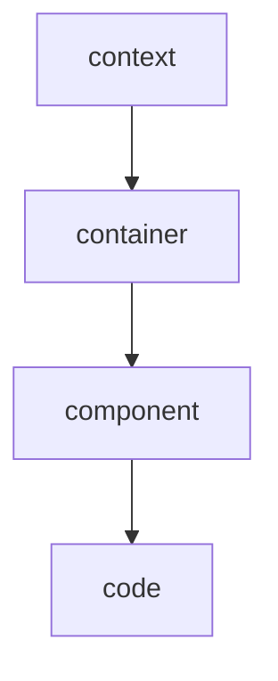
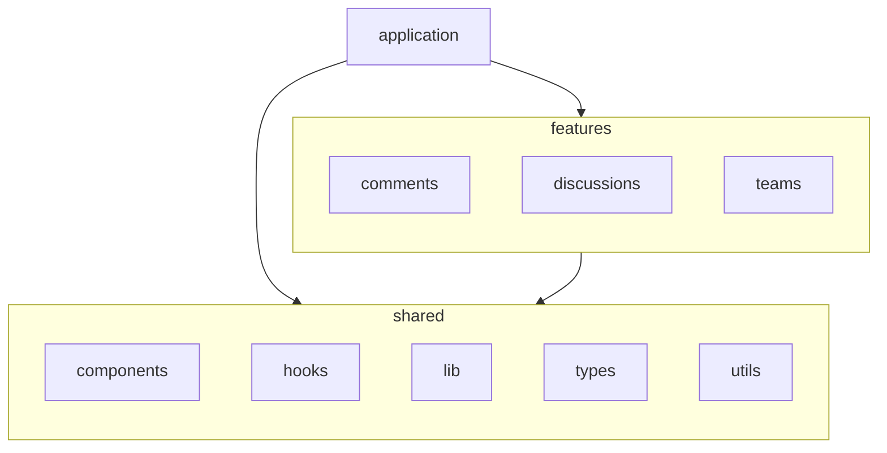

> [!important]
>
> - とにかく関心事を切り離す。関心事が $N$ あれば、思考に $O(N^2)$ 掛かる。
> - 層をまたいでの思考を防ぐ。特に高レイヤに関する議論は低レイヤの詳細に話が行きがちであるので、これを防ぐ。

## アーキテクチャの例

アーキテクチャの話をするとき、たとえば [C4 model](https://c4model.com/diagrams) におけるどの層の話をしているか、考える。

context について考えるときは、技術的詳細を考えないようにし、[ユースケース](https://wa3.i-3-i.info/word16097.html) に意識を集中させる。

## Web フロントエンドの例

Web フロントエンドの話をするとき、たとえば [bulletproof-react](https://github.com/alan2207/bulletproof-react/blob/master/docs/project-structure.md) におけるどの層の話をしているか、考える。

features について考えるときは、shared の UI・UI ロジックの詳細を考えないようにし、[ビジネスロジック](https://wa3.i-3-i.info/word13666.html) に意識を集中させる。
